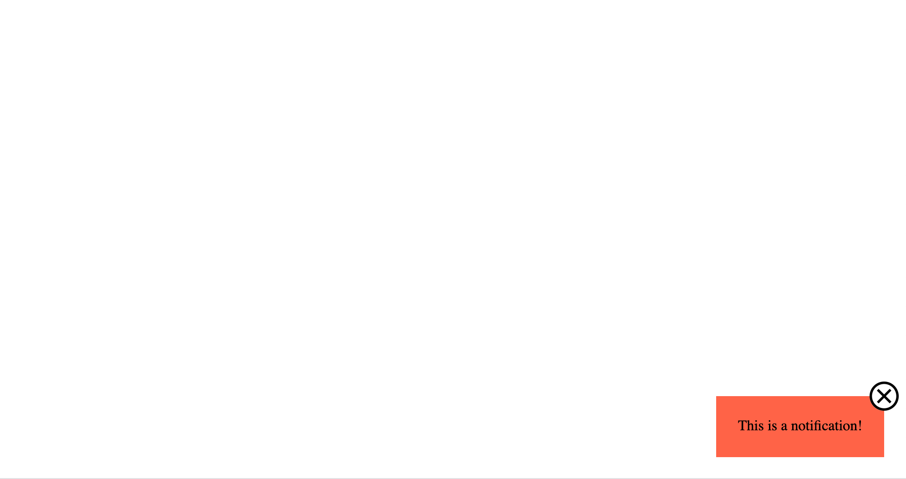

# Popup-Benachrichtigung

Verwende das mitgelieferte HTML-Dokument, um das kleine Benachrichtigungs-Popup zu erstellen, das im folgenden Referenzbild zu sehen ist.

### Anleitung

- Ändere nichts am HTML-Code, verwende einfach dieselben Klassen oder Selektoren, um dein CSS-Stylesheet zu erstellen.
- Egal wie groß das Browserfenster ist, die Benachrichtigung sollte immer in der rechten unteren Ecke erscheinen
- Das X-Symbol muss in einer Größe von 32x32px erscheinen.
- Du musst den Standardstil des `<button>`-Elements überschreiben, damit das Symbol so erscheint, wie es soll
- Versuche, es so pixelgenau wie möglich zu gestalten.
